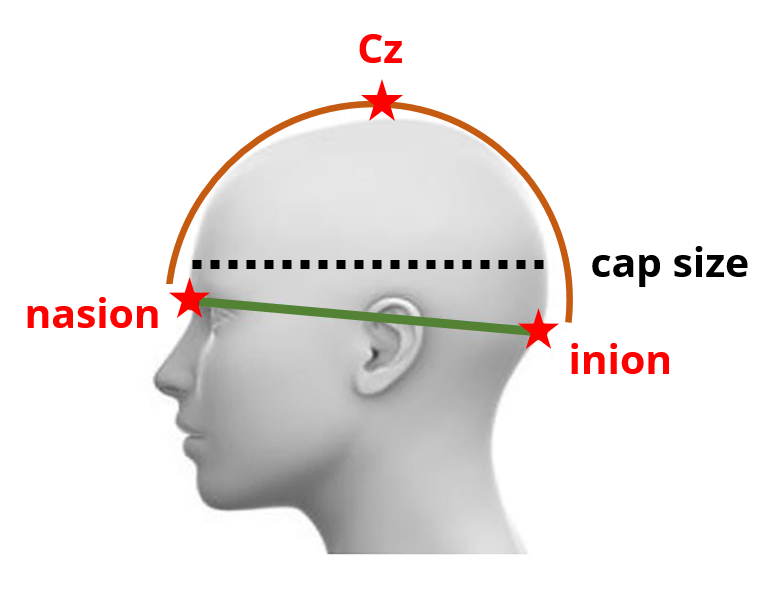
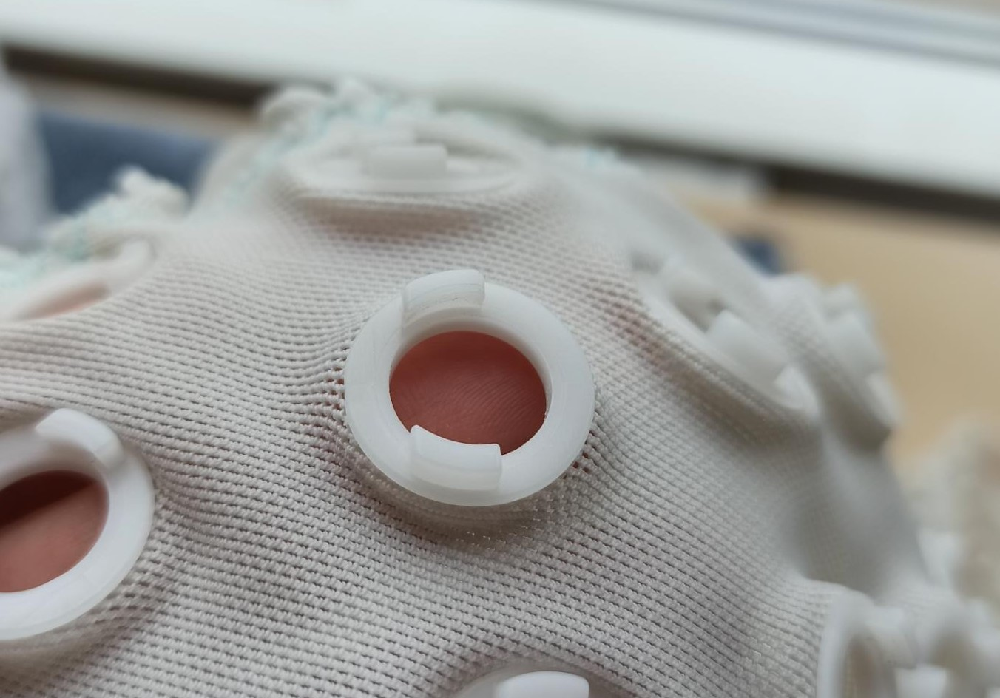
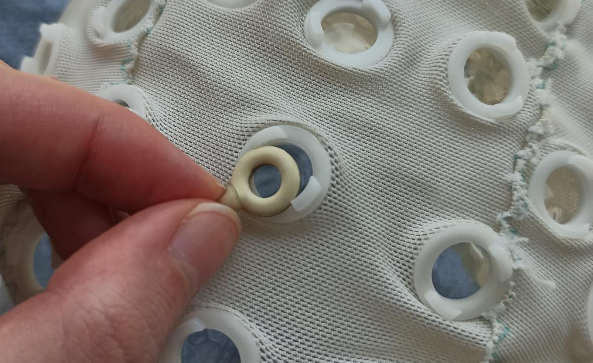
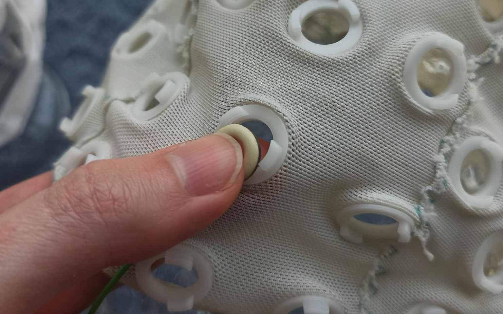

# How to set up an EEG recording in the lab

[Josephine Zerna](mailto:josephine.zerna@tu-dresden.de) 
Faculty of Psychology 
TU Dresden

---

## Table of Contents

- [Before](#before)
  - [What to prepare before the study](#what-to-prepare-before-the-study)
  - [What to prepare before each session](#what-to-prepare-before-each-session)
  - [How to inform your participants](#how-to-inform-your-participants)
- [During](#during)
  - [Picking the correct cap](#picking-the-correct-cap)
  - [Connecting the electrodes](#connecting-the-electrodes)
  - [Placing the cap correctly](#placing-the-cap-correctly)
  - [Skin treatment](#skin-treatment)
  - [Troubleshooting](#troubleshooting)
- [After](#after)
    - [Cleaning at the end of each session](#cleaning-at-the-end-of-each-session)
    - [Long-term maintenance of equipment](#long-term-maintenance-of-equipment)

---

## Before
### What to prepare before the study

When preparing your study, make sure that you have the following points covered:
- theory-driven electrode placement (as there is no point in doing a 64-channel EEG when you are only interested in a small cluster of channels)
- the computer paradigm is linked with your physiology software (e.g. [BrainVision Recorder](https://brainvision.com/products/recorder/)) and sends unique triggers for all event types, so when looking at the EEG data afterwards, you know exactly when a stimulus appeared on screen and what kind of stimulus it was
- every necessary piece of equipment is functional and in case it suddenly breaks, you have access to spare equipment - e.g. borrowing something from another lab - so your sessions can continue until your equipment is repaired or replaced
- in the invitation/reminder emails for your participants, emphasize that they need to wash their hair on the session day or the day before, and avoid using styling products like hair gel, because this will impair the EEG measurement (they can wash their hair in the bathroom next to the lab after the session)

### What to prepare before each session

This is a list of items you will need for every EEG session:
- A fully charged powerpack
- An amplifier, connected to the powerpack and your physiology software
- A plugboard, connected to the amplifier
- As many electrodes as you need, connected to the plugboard (to make it easier for yourself later, avoid consecutive placements of the same colour)
- Cotton swabs, preferably one-sided and wooden
- Cotton rounds
- Antiseptic solution in an open container (about a third of a shot-glass is enough for one session)
- Abrasive paste in an open container (a dollop of the size of 1-2 hazelnuts is enough for one session)
- A syringe with a drawing up needle, filled with electrolyte gel and no air bubbles
- Plaster tape
- Measuring tape
- Tissue box

### How to inform your participants

Many participants have never taken part in an EEG study before, so your study might very well be their first EEG experience.
As a consequence, many are nervous because they don't know what to expect, and some even have misconceptions about EEG measurements (be prepared for the question "So, can you see my thoughts now?" - it comes up *a lot*).
So make sure you always ask them whether they have participated in an EEG study before, and adjust the amount of information that you need to convey accordingly.
If you want to cover all you bases, this paragraph touches on the most common issues:

> Today, we will also record an EEG.
This means that I will measure the circumference of your head to pick the correctly sized cap, and then attach the electrodes to the cap and place it on your head.
It will be secured with a chin-strap because it is important that it sits in the right place.
The electrodes are only "listening", so they will not give you an electric shock or anything.
Then I will use the back of the cotton swabs [show the swab] to push the hair in each electrode hole aside, and prepare your skin with this antiseptic solution and this abrasive paste [show both].
The antiseptic solution is to clean and desinfect your scalp, the abrasive paste is to remove any oil and loose, dead skincells.
This paste contains salt and is like a peeling, so I have to apply a bit of pressure, and everybody's skin is different - if it feels uncomfortable, just let me know.
For some people, the paste is a bit irritating to the skin, but the vast majority of participants have no trouble at all, and you can wash your hair right afterwards, so don't worry.
When your hair is pushed aside and your skin is clean, I will fill the electrode hole with this electrolyte gel to bridge the gap between scalp and electrode.
This syringe looks scary but it is absolutely harmless because it is blunt, I just need it for precision [take the syringe and stab the inside of your palm with it, so they see that it really is blunt, a lot of people are scared of syringes].
We need to make sure that the electrical resistance at every electrode is very low, so they can pick up the signals from your brain, so all of these red dots here [show them the recording software on screen] need to be green.
This might take a while depending on your hair and scalp properties, about 20 to 30 minutes for a 30-channel EEG.
And because standing up with the cap would nullify all our preparation efforts, I would ask you to use the restroom before EEG preparation, so you can remain seated during preparation and the task afterwards. After the task, I will remove the cap, which only takes a few seconds, and then you can go over to the bathroom to wash and dry your hair.

And even if you have said all that, **always** ask the participant whether they have any questions, and tell them that they can ask these questions at **any time**.

## During
### Picking the correct cap

It is absolutely vital to pick a cap of the correct size.
If it is too tight, the participant is uncomfortable and it will slide up over time, if it is too loose, it moves around and the electrolyte gel spreads between cap and scalp, creating bridges between electrodes that result in noisy signal.

To measure the circumference of the head, place one end of the measuring tape on the forehead and loop it around, trying to find the widest point of the head while also staying horizontal (the dotted black line in the picture below).
Every head is unqiue, so if the tape is a bit lower at the back of the head, it's fine, just try not to angle it too much.
In adults, you will likely get a result between 54 and 60 centimeters, the average is 56.

Our lab has caps in four different sizes: 54, 56, 58, and 60.
A 52 would technically also be available, but since it has a smaller surface, it does not have slots for as many channels as the other caps, so check beforehand whether the electrodes that you need would also work with the 52 cap.
If your participant has a head circumference of exactly one of these caps, then pick that one.
If the circumference is in-between (i.e. 55, 57, 59, 61), then pick the smaller cap, because they are made of flexible material and the possibility of slight discomfort is still better than unusable data from a too-large cap.

### Connecting the electrodes

Depending on how many electrodes you have, this will take a few minutes
It might be a good idea to take the participant's measurements early on, so they can fill out a questionnaire or do another part of the study while you connect the electrodes to the cap.
If you have electrodes in multiple colours, you can use the colours to make the process easier for you, e.g. if you put alternating colours in the plugboard but end up with two blue electrodes next to each other on the cap, you know that you made a mistake.

The little plastic slots are only placed into cuts in the fabric, so you can rotate them to your needs, but you should treat them gently as to not damage the fabric.
Each slot has a narrow and a wide gap:

As the electrodes are quite sensitive as well, especially at the "neck", the correct handling of electrodes and cap slots is crucial in giving your equipment a long life.
There are two good ways to insert an electrode into its slot: Holding it at its neck and pushing through the wide gap (ideally with you other hand applying counterpressure, mine was busy taking the picture):

or by placing one finger underneath the slot and your thumb on top of the electrode, sliding it in:

If correctly inserted, you should hear a faint click.
*Never ever try to fit it through the narrow gap, never ever pull at the electrode cable, and never ever try to force the electrode in by pushing from the top.*

### Placing the cap correctly

Before you put the cap on the participants head, you must ensure that the cap will be placed correctly (see image above).
Take you measuring tape and place one end at the bridge of the nose, between the eyebrows (nasion).
Guide the tape across the top of the head to the back, feeling with your finger for the point where the scalp protrudes before curving inward to the neck (inion).
This is very pronounced in some people and very subtle in others, so it might take a few seconds to find the right spot.
Tell your participant what you are doing, so they don't think you're a creep.

Measure the distance between nasion and inion, and make a note of it.
Now you can put on the cap.

Since the cap has a tight fit and the material is quite slippery, it is a good idea to ask the participant to hold the front of the cap to their forehead while you pull it over the back of their head.
Now you adjust the cap's position by placing one end of the measuring tape at the nasion again and guiding it across the top of the head.
The slot for electrode Cz needs to be at the halfway-point between nasion and inion.
If it is not, carefully pull the cap forwards or backwards, and measure again until you have the correct position.
You can check the left-right-symmetry of the cap by standing on your tiptoes and looking down on the head from above, or by measuring along the top of the head from ear to ear as well.

Take a chin-strap to fix the cap in place, asking the participant whether it is uncomfortable.
It should be tight, but it should not hinder swallowing or breathing.

### Skin treatment
### Troubleshooting
## After
### Cleaning at the end of each session
### Long-term maintenance of equipment