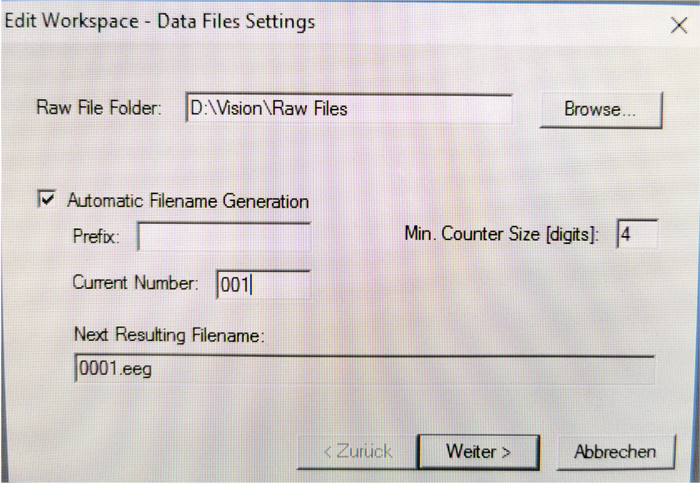

# Data Aquisition with BrainVision Recorder

[Anne Gärtner](mailto:anne_gaertner@tu-dresden.de) 
Faculty of Psychology 
TU Dresden

The BrainVision Recorder (by Brain Products, [Download here](https://www.brainproducts.com/downloads/recorder/)) is a multifunctional recording software for EEG and peripheral physiological (e.g. EDA, EMG, ECG) data. The software is installed on two data acquisition computers in the laboratory.

## Setting up a workspace for peripheral physiological data
The first step is to create a new workspace or to edit an existing workspace. 

 

Next, if the amplifier is connected, the following settings can be defined: number of cannels, sampling rate (e.g. 1000 Hz), and physical channels (the numbers correspond to the numbers on the pegboard). If EDA data will be collected, "Use ExG AUX" (auxiliary EDA module) has to be checked. 

pic 2 here

Now, it is possible to create raw data saving filters, segmentation filters or display filters. In order to see the signal appropriatley, the following display filters might be used (low cutoff, high cutorff):  
ECG: 1 – 40 Hz  
EMG: 24 - 400 Hz  
EDA: 0 - 1 Hz (or 0.1 – 2 Hz)  

pic 3 here

The last step is to save the settings under an existing or a new workspace name.

pic 4 here 

## Applying electrodes

The procedure for applying electrodes is described here (XXX) for EEG and here (XXX) for peripheral physiological measurements.

## Impedance check

Before data acquisition, impedances have to be checked (under "Impedance check") to be below certain thresholds: <50 kOhm for ECG and <10kOhm for EMG and EEG. Impedances for EDA cannot be checked (because what you measure is the reciprocal value of the skin resistance in kOhm).

pic 5 here

## Data montoring

The last step is to look at the signal under "Monitor" and indicate artifacts to the subject. For example, an EDA response can be triggered by inhaling deeply. Artifacts for ECG can be seen by moving or tighten the arm muscles. EMG acitivity can be seen for smiling (Zygomaticus) or frowning (Corrugator) 

pic 6 here
