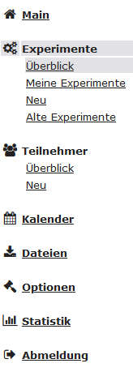

# Participant recruitment and session scheduling using ORSEE

[Josephine Zerna](mailto:josephine.zerna@tu-dresden.de) 
Faculty of Psychology 
TU Dresden

The Online Recruiting System for Economic Experiments ([ORSEE](https://github.com/orsee/orsee)) is a digital platform offering subplatforms for each university.
The version for the TU Dresden is called *Zentraler Experimentalserver der Psychologie* (ZEP).

## Account
If you need participants for an experiment and don't have an account yet, please write an informal email to [Pauline Thamm](mailto:pams@tu-dresden.de), asking her to create an admin account for you.
She is a research assistant with a temporary position there, so please check [here](https://zep.psych.tu-dresden.de/orsee/public/impressum.php) whether there might be a new person to contact.
After your account has been created, you can log in as an admin [here](https://zep.psych.tu-dresden.de/orsee/admin/admin_login.php?requested_url=admin%2Findex.php%3F).

## Sidebar
This is the sidebar that you will see as an admin (even though English exists as a language option, I cannot switch to it, so German will have to do for now): 
 
* Main: Displays a brief version of the code of conduct.
* Experiments-Overview: Displays a list of all experiments currently being organized via the ZEP, their respective admin, their session times, etc.
* Experiments-My Experiments: Displays your own current and past experiments. The part you will use most often.
* Experiments-New: Displays the form to create a new experiment.
* Experiments-Old Experiments: Displays a list of all past experiments by other people, their respective admin, their session times, etc. You will probably never need this part.
* Participants-Overview: Allows you to look into all the people who are registered candidates in the ZEP.
* Participants-New: Here you can add a new candidate to the ZEP pool, for example if you had a participant in your study that you recruited via another route, but they are interested in participating more often.
* Calendar: Displays a very very very colourful calendar of all currently scheduled sessions of all experiments in the ZEP. Filtering by location is most useful, as you are interested in whether your lab is free at your desired time.
* Data files: Here you can up- or download entire experiment files from your own or other experiments.
* Options: Set recurring tasks, settings, and your password.
* Statistics: Not really of relevance for you as a single researcher but probably for the faculty as a whole, some pie charts and bar charts about participation rates and such.
* Log-out: Well, to log out.