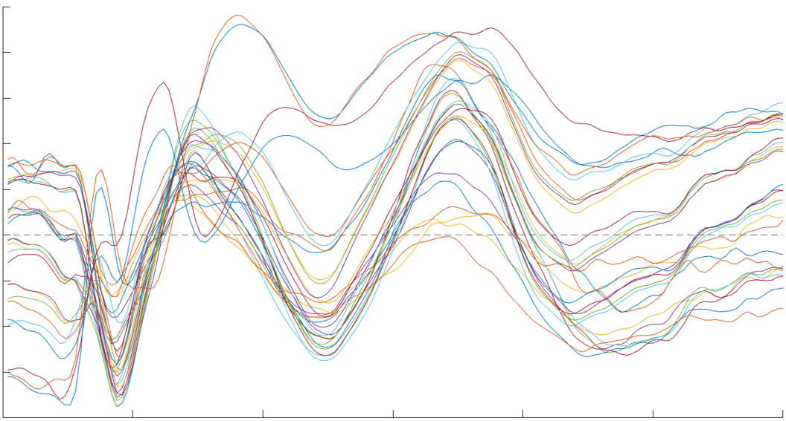

# EEG Microstate Analysis

[Josephine Zerna](mailto:josephine.zerna@tu-dresden.de) 
Faculty of Psychology 
TU Dresden

---

## Table of Contents

- [What are microstates?](#what-are-microstates?)
- [Why should I use microstate analysis?](#why-should-I-use-microstate-analysis?)
- [What software do I need?](#what-software-do-I-need?)
- [How should my data look like?](#how-should-my-data-look-like?)
- [How exactly do you compute microstates?](#how-exactly-do-you-compute-microstates?)
    - [Global differences](#global-differences)
    - [Local differences](#local-differences)
- [That was confusing - are there example scripts?](#that-was-confusing---are-there-example-scripts?)

---

## What are microstates?
The term microstate refers to a phenomenon in electroencephalography (EEG) analysis, where the voltage of all channels appears to be relatively stable for several tens of seconds before changing into a different quasi-stable voltage pattern (see [Lehmann, 1987](https://doi.org/10.1016/0013-4694(87)90025-3)).
This temporal *chunking* of brain activity has lead some researchers to assume that microstates could represent "atoms of thought", i.e. the building blocks that make up cognition. 
This image is a series of microstates (head plots seen from above, colour indicates voltage) from a task-based paradigm, spanning the first 250 ms after stimulus onset:

You can see that each microstate is slightly or drastically different in its topographical distribution of activity to the microstate before or after it.
The image itself is pretty to look at but not really informative, which is why you want to compute comparisons between the microstates of different experimental conditions to see where there are statistical differences (see section on [computation](#how-exactly-do-you-compute-microstates)).

## Why should I use microstate analysis?
Microstate analysis has the big advantage of not only using the temporal properties of EEG but also its spatial properties.
Most EEG analysis methods, like event-related potential analysis (ERP), are spatially confined, so you look at the activity of a few adjacent channels.
What this does not consider is the **Problem of Cognitive Subtraction**: Changing one aspect of a task leads to changes in more than one brain region.
So when you compare two experimental conditions, e.g. looking at positive and negative pictures, you should not confine your analysis to a few channels because then you will miss everything that might be going on outside of them. 
Microstate analysis has mostly been applied to resting-state EEG data, where studies have focused on four different classes, i.e. four very extreme patterns of spatial distributions, and how these classes differ in duration and transition times between healthy and clinical samples.
However, this method has been criticized for leaving a large portion of data unexplained, ignoring less extreme topographies, and disregarding overlap of these classes.
So applying microstate analysis to task-based data is a great way to have a data-driven analysis that neither ignores a majority of channels nor large parts of the time window.

## What software do I need?
I strongly recommend using [Matlab](https://de.mathworks.com/products/matlab.html) and its plugin [EEGLAB](https://sccn.ucsd.edu/eeglab/index.php), which offers you both a GUI and the option to use Matlab code.
Here is an overview of what you can do with EEGLAB from their website:

You will mainly need code for microstate analysis, because there are no functions for it yet, but we can make use of the excellent data structure offered by EEGLAB:

So that means you will need Matlab coding skills.

## How should my data look like?
EEGLAB can import all sorts of data formats, so you can refer to their [tutorial page](https://eeglab.org/tutorials/04_Import/Importing_Continuous_and_Epoched_Data.html) on how to best import your format.
At AG.DPP we record EEG data with the [BrainVision Recorder](https://brainvision.com/products/recorder/), which means you can either do preprocessing using the [BrainVision Analyzer](https://brainvision.com/products/analyzer-2/) and import your .set-files into EEGLAB or import the Recorder files into EEGLAB directly and complete the preprocessing there.
To compute microstates you'll want to have epoched, preprocessed data.
Your preprocessing could look something like this:
* re-referencing to mastoids or grand average
* downsampling to 250 Hz
* 50 Hz notch filter
* zero phase shift Butterworth filters (2nd order low cutoff at 2 Hz, 4th order high cutoff at 40 Hz)
* segmentation into your target epoch length, e.g. 500 ms
* baseline correction using the 200 ms before stimulus onset
* manual artifact correction
Naturally, your data needs to contain the trigger information, so you'll know which epoch belonged to which condition.
That also means that if you do preprocessing using the BrainVision Analyzer and you want to analyze a period that does not contain the stimulus onset, you have to retain the stimulus onset until after you have imported your data into EEGLAB and then shorten the epochs, otherwise the trigger codes will be lost.

## How exactly do you compute microstates?
1. Calculate the mean activity across all epochs per subject, yielding one *channels* x *time points* ERP per subject. 
If your study contains conditions that are extremely different from each other, e.g. when subjects look at a picture vs when subjects look at words and have to press a key, and you don't intend to compare these two conditions but rather compare things within these conditions, then please do this and all of the steps below separately for these conditions.
2. Normalize each subject's ERP by dividing it by the global field power of that subject. Global field power is the standard deviation of activity per channel and time point across all epochs.
Normalizing the ERPs ensures that microstates will be built not by the extremity of the topographical distribution but by its pattern.
3. Compute the mean across all subjects' normalized ERPs, so you end up with one grandmean of *channels* x *time points* (no need to visualize it, but this is what it should look like):

The y-axis is the voltage, the x-axis is the time.
Each coloured line is one channel. 
In this example, we have 30 channels and 150 sampling points (600 ms with 250 Hz).
Think of it as 150 different 30-dimensional vectors.
4. Put these vectors into a *k*-means clustering algorithm (supplied by Matlab).
Depending on your time window, you need to adjust the number of clusters *k* that are being tested.
If your time window is longer than 500 ms, a lower limit of 2-5 and an upper limit of 20-25 is sensible.
If your time window is longer than 1,000 ms, you can increase that to 5-8 and 25-40.
Keep in mind that the number of clusters does not directly correspond to the resulting number of microstates because a topographical pattern can appear more than once in your time window.
5. Decide on the number of clusters that best represents the data.
Plot the duration of each resulting microstate per *k* (left panel), the number of microstates per *k* (middle panel), and the sum of inner cluster distances per *k* (right panel):

This is from a different analysis with a larger time window of about 1.2 seconds.
The left and right panel are most relevant for your decision process.
Your goal is to find a cut-off in the elbow plot on the right where the sum of inner cluster distances ceases to decrease dramatically.
Basically, avoid over-fitting the data, which would be the case if your *k* comes close to the number of vectors.
The left plot helps you with that by showing you the duration of the resulting microstates.
If a cluster option looks good based on the elbow plot but you can see very short durations on the left, that are too short to be considered a microstate, look for another option.
Be careful, sometimes a resulting "microstate" is so short that it is barely visible in the left plot. 
This is the only truly subjective step in the analysis process, so feel free to consult a colleague for a second pair of eyes, or continue the analysis with a specification curve aka by doing the analysis with different cluster options and seeing how it affects the results (I've been wanting to do that for quite a while and I hope I'll have the resources to do so).
6. Compute an ERP across subjects for every condition that is of interest to you.
If you want to compare the condition "looking at positive pictures" and "looking at negative pictures", then you will need two ERPs based on the epochs that belong to those conditions.
Please retain all channels and all time points, so each ERP consists of e.g. 150 different 30-dimensional vectors.
7. Normalize each condition's ERP by dividing it by the global field power of that condition.
8. Apply the clustering result of your choice to the ERPs:

Here we are back to our example with the 600 ms time window.
Each vertical line indicates where the microstate begins and ends.
As you can see, the duration of each microstate varies a lot throughout the time window. 
Now you have to calculate the mean across all time points within a microstate. In this example it would yield 18 different 30-dimensional vectors, determined by 14 clusters.

### Global differences
To compare the microstates of two conditions, you need cosine similarity, which is a measure for how alike two vectors are:

This is a sketch for two three-dimensional vectors, but an EEG vector has as many dimensions as you have channels, so I suppose not even Dr Strange could show you an image of how a 30-dimensional vector might look like. 
So for each microstate pair, you compute the cosine similarity.
And because that in and of itself does not tell you anything about whether it is a significant difference or not, you will create a null distribution of cosine similarities based on the same underlying data.
The process is called topographical analysis of variance (TANOVA) even though it has nothing to do with a classic ANOVA.
Follow these steps:
1. Put the epochs (of all subjects) of each condition pair into a pool.
If you want to compare condition A with B and condition A with C, you will need two pools, one with data from A and B, and one with data from A and C.
2. Make a note of how many epochs are from condition A, B, and C.
3. Randomly shuffle the pool across epochs.
4. Re-label one half of the epochs as one condition and the other as the second condition.
So if you have your A-B-pool, label one half as A and one half as B.
To be precise, don't just talk halves but use the number of epochs that you noted down in step 2.
5. Compute the averages of the newly labelled conditions in the pool.
6. Turn each condition average into microstates by averaging the corresponding time points, just like you did above in step 8.
7. Between each microstate pair, i.e. microstate 1 of condition A and microstate 1 of condition B, compute the cosine similarity:
$\cos \theta = \frac{|A||B|}{\vec{|A|}\vec{|B|}}$  
Note that the denominator is referring to the vector’s Euclidean norm.
8. Repeat steps 1-7 at least 3,000 times to get a null distribution for each microstate pair of your condition comparisons.
Depending on how many channels, epochs, and conditions you have, this process will take several hours or even days.
9. Calculate your actual $\cos \theta$ values by applying the equation to your condition microstates.
10. Sort each microstate pair's null distribution in ascending order.
11. Determine the first value (let's call it *v*)for each actual $\cos \theta$ in its corresponding null distribution that is bigger than the $\cos \theta$.
So if your have 3,000 values and your $\cos \theta$ is smaller that the smallest value, it will be *v* = 1, if it is bigger than the biggest it will be *v* = NaN, and if it is somewhere in between it will be between *v* = 2 and *v* = 3,000.
12. Determine you adjusted *p*-value by dividing your alpha by the number of microstates, e.g. $p_{adj} = \frac{0.05}{18} = 0.0028$.
13. Derive your significance cut-offs from $p_{adj}$ by multiplying the number of values in the null distribution with half of $p_{adj}$, e.g. the lower cut-off is $3,000 * \frac{0.0028}{2} = 4.2$, and the higher cut-off is $3,000 * (1-\frac{0.0028}{2}) = 2995.8$.
14. For each actual $\cos \theta$, determine whether its *v* is either smaller than the lower cut-off or larger than the higher cut-off.
So for an actual $\cos \theta$ to be significant in our example it would either have to be rank position 0, 1, 2, 4, 2,996, 2,997, 2,998, 2,999, 3,000, or NaN.
15. It is rare for microstate pairs to be beyond the upper limit of the null distribution, because a $\cos \theta$$ approaching 1 implies that two vectors are more similar than those created at random.
So if it happens, then usually in the first microstate before even perceptual components of cognitive processing have "kicked in".

### Local differences
## That was confusing - are there example scripts?