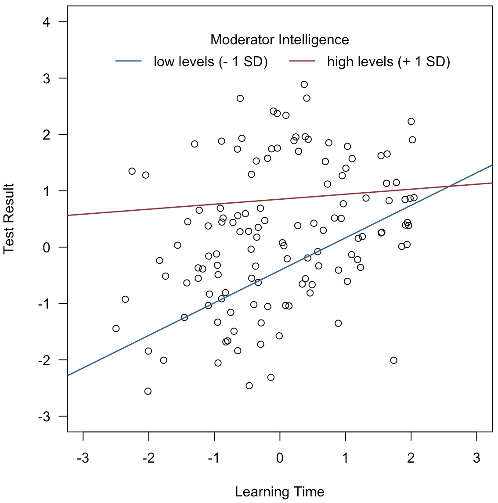

# Mediation and Moderation

[Alexander Strobel](alexander.strobel@tu-dresden.de)<br>
Faculty of Psychology, TU Dresden

2022-04-12

---

## Table of Contents

- [Mediation and Moderation](#mediation-and-moderation)
  - [Table of Contents](#table-of-contents)
  - [Introductory remarks](#introductory-remarks)
  - [Mediation analysis](#mediation-analysis)
  - [Moderation analysis](#moderation-analysis)

## Introductory remarks

Mediation and moderation analysis are often used tools (not only) in individual differences research.
Apart from being regression-based techniques, these analysis approaches do not have much in common.
Still, both techniques are often taught together, perhaps because the authors that introduced (or elaborated on) them are the same, perhaps it is due to the fact that the relationship of two variables *X* and *Y* is to be considered differently when accounting for a third variable *Z*, but perhaps it is simply because both techniques start with an *M*.

## Mediation analysis

In *mediation* analysis, one wants to determine the extent to which the relationship of an independent variable *X* and a dependent variable *Y* can be (partly or fully) explained by a third *mediating* variable *M*.
One standard example is that the relation between the number of storches and the number of births in a given region can be explaied by the urbanization of that region.

To test for such a mediation, one simply runs a series of regressions:

1) *Y* is regressed on *X*, which gives the direct relationship between the independent and the dependent variable. This path is usually denoted as path *c*.
2) *M* is regressed on *X*, which gives the direct relationship between the independent vaiable and the mediator. This path is usually denoted as path *a*.
3) *Y* is regressed on both *X* and *M*. This gives the relationship of *X* and *Y* when controlling for *M* (denoted as path *c'*) as well as the relationship of *M* and *Y* when controlling for *X* (denoted as path *b*).

In R notation, this would boil down to:

```R
lm(Y ~ X)      # path c
lm(M ~ X)      # path a
lm(Y ~ X + M)  # paths b and c' 
```

This series of regressions informs you about the *direct* relationship between *X* and *Y* *without* considering the mediator *M* (i.e., path *c*) and *with* considering the mediator *M* (i.e., path *c'*) as well as on the indirect relationship of *X* and *Y* via the mediator *M*, which is the product of paths *a* and *b*. It follows that:

```R
cprime = c - a * b
```

For details on mediation analysis, see:

- [David A. Kenny: Mediation](https://davidakenny.net/cm/mediation.htm)

## Moderation analysis

In *moderation* analysis, one wants to determine whether a relation between an independent variable *X* and a dependent variable *Y* differs depending on the levels of a third *moderating* variable *M*.
One example would be that the relationship between the time invested in learning and a test result is moderated by intelligence: individuals with a low level of intelligence need to invest more time to yield good test results than individuals with a high level of intelligence.

To test for moderation, one first needs to mean-center (not standardize!) *X* and *M*. Then, a regression analysis with an interaction term is performed:

```R
X = scale(X, scale = F)
M = scale(M, scale = F)
lm(Y ~ X + M + X:M)
```

A significant interaction effect `X:M` means evidence for a moderation effect.
Yet, we still do not know exactly how this interaction looks like.
We therefore perform a simple slope analysis, i.e., we compare the regression slopes at low vs. high levels of *M* (for a continuous moderator typically one standard deviation below or above the mean). To do so, we need to perform a highly counterintuitive calculation:

```R
M_lo = M + sd(M)
M_hi = M - sd(M)
```

If we now include these newly calculated variables into our regressions, we get the simple slopes for low vs. high levels of the moderator:

```R
# slope for X gives simple slope for low levels of moderator
lm(Y ~ X + M_lo + X:M_lo) 

# slope for X gives simple slope for high levels of moderator
lm(Y ~ X + M_hi + X:M_hi) 
```

The result could look like this:




For details on moderation analysis, see:

- [David A. Kenny: Moderation](https://davidakenny.net/cm/moderation.htm)

