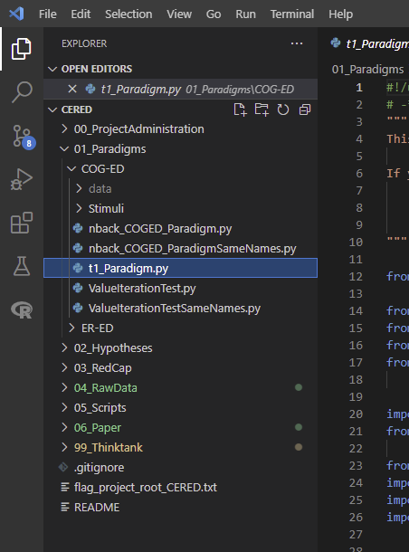
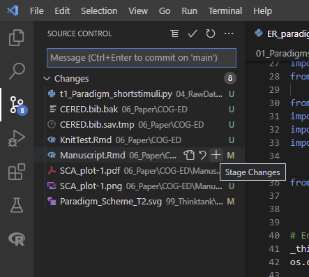
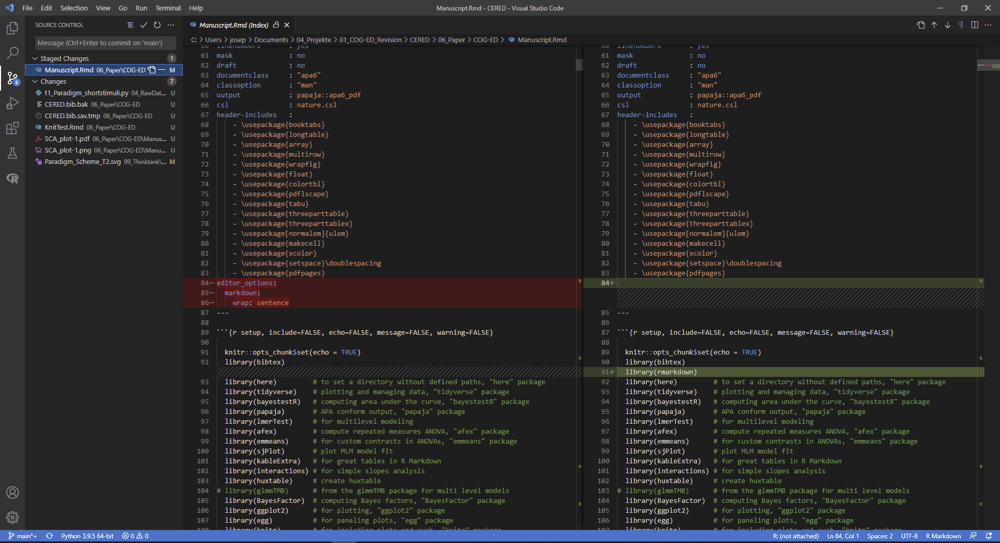
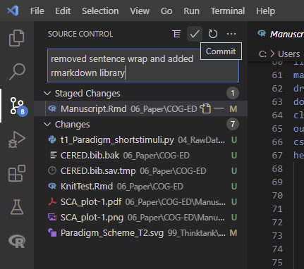
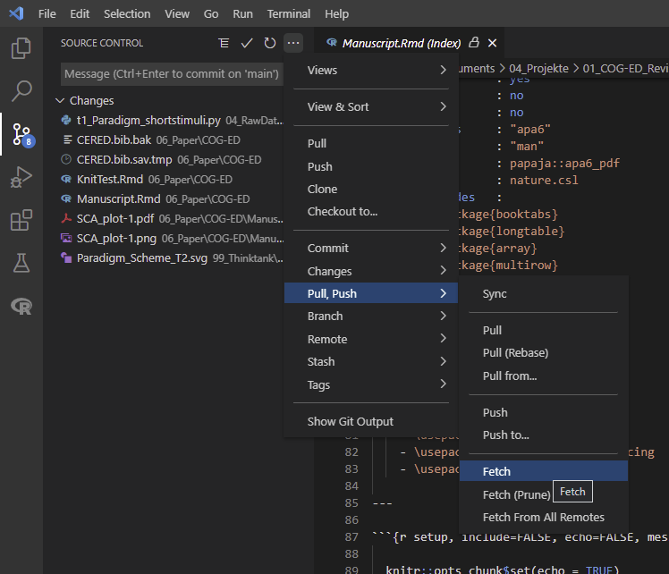
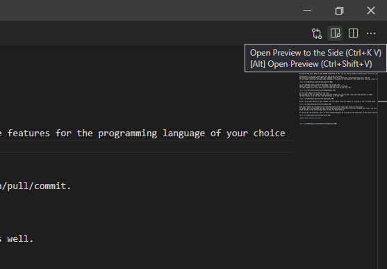
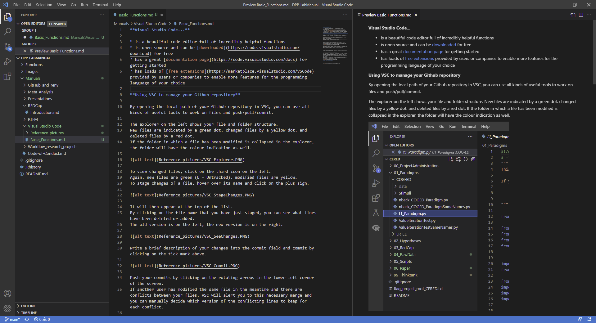
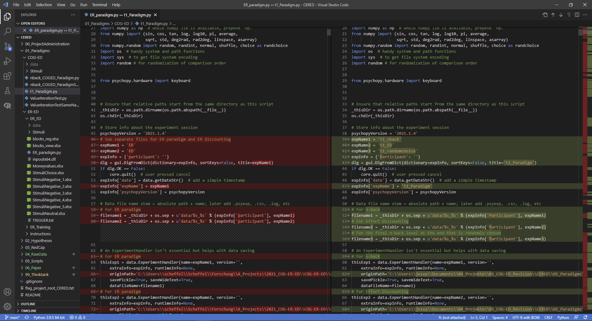
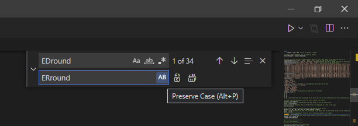
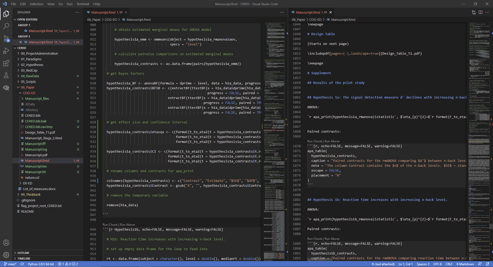

# Visual Studio Code

[Josephine Zerna](mailto:josephine.zerna@tu-dresden.de) 
Faculty of Psychology 
TU Dresden

---

## Basic functions

**Visual Studio Code...**

* is a beautiful code editor full of incredibly helpful functions
* is open source and can be [downloaded](https://code.visualstudio.com/download) for free
* has a great [documentation page](https://code.visualstudio.com/docs) for getting started
* has loads of [free extensions](https://marketplace.visualstudio.com/VSCode) provided by users or companies to enable more features for the programming language of your choice

### Using VSC to manage your Github repository

By opening the local path of your Github repository in VSC, you can use all kinds of useful tools to work on files and push/pull/commit.

The explorer on the left shows your file and folder structure.
New files are indicated by a green dot, changed files by a yellow dot, and deleted files by a red dot.
If the folder in which a file has been modified is collapsed in the explorer, the folder will have the colour indication as well.

To view changed files, click on the third icon on the left.
Again, new files are green (U = Untracked), modified files are yellow.
To stage changes of a file, hover over its name and click on the plus sign.

It will then appear at the top of the list.
By clicking on the file name that you have just staged, you can see what lines have been deleted or added.
The old version is on the left, the new version is on the right.

Write a brief description of your changes into the commit field and commit by clicking on the tick mark above.

Push your commits by clicking on the rotating arrows in the lower left corner of the screen.
If another user has modified the same file in the meantime and there are conflicts between your files, VSC will alert you to this necessary merge and you can manually decide which version of the conflicting lines to keep for each conflict.

Of course you can also push, pull, or fetch anytime manually by clicking on the three dots in the source control panel.

### Other great features of VSC

While editing markdown files, you can click on the symbol in the upper right corner to open a viewer pane in which all of your syntax appears in its final form.

When you need to compare two files, right click on the first one in the explorer and choose "Select for Compare".
Then right click on the other one in the explorer and choose "Compare with Selected".
A side-by-side view will open in which you can see deleted and added lines just like in the source control view.

The **find-and-replace function** can be accessed via ctrl+F.
If you just want to find something, type it into the field and click enter.
If you want to replace a string, click on the little angle next to the field, so that the second line opens.
The find-and-replace functions are fantastic:
* in the upper line, *Aa* allows you to match the case, looking only for strings with the same uppercase and lowercase letters
* next to that is the *ab* word wrap that only looks for entire matches
* and next to that is the option *.** to use regular expressions to search for partial matches
* in the lower line, *AB* allows you to preserve the case when replacing the string, so in this case *EDround* would be changed to *ERround*, and *edround* would be changed to *erround*. Since most programming languages are case sensitive, this is a great feature
* next to that is the button to replace the occurence that is hightlighted at the moment or
* the button to replace all occurences of that string

Sometimes you want to edit a file and need the exact names of variables that appear a lot earlier or later in the file.
VSC can save you from endlessly scrolling and forgetting the correct spelling by using the **split-function**.
Simply open the desired file by double-clicking on it in the explorer bar on the left.
Then, right-click on the tab of the file and select your preferred split view (Split Up/Down/Left/Right).
Voilá, you now have your file open in two columns side by side.
You can scroll through your file independently and use the search-function independently, but any kind of change in the file content will be implemented in real-time in the other column, without hopping to that line of code.
Neat!

